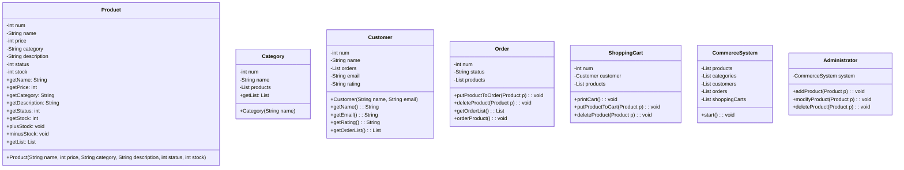

# CH2Commerce

스프링 부트캠프 커머스 과제

```mermaid
classDiagram
    class Product {
        -int num
        -String name
        -int price
        -String category
        -String description
        -int status
        -int stock
        
        +Product(String name, int price, String category, String description, int status, int stock)
        
        +getName: String
        +getPrice: int
        +getCategory: String
        +getDescription: String
        +getStatus: int
        +getStock: int
        
        +plusStock: void
        +minusStock: void
        
        +getList: List<String>
        
        
    }
    class Category {
        -int num
        -String name
        -List<Product> products
        
        +Category(String name)
        
        +getList: List<String>
    }
    class Customer {
        -int num
        -String name
        -List<Order> orders
        -String email
        -String rating
        
        +Customer(String name, String email)
        
        +getName() : String
        +getEmail() : String
        +getRating() : String
        +getOrderList() : List<Order>


    }
    class Order {
        -int num
        -String status
        -List<Product> products

        +putProductToOrder(Product p): void
        +deleteProduct(Product p): void
        +getOrderList(): List<Product>
        +orderProduct(): void
        
    }
    class ShoppingCart {
        -int num
        -Customer customer
        -List<Product> products
        
        +printCart(): void
        +putProductToCart(Product p): void
        +deleteProduct(Product p): void
    }
    class CommerceSystem {
        -List<Product> products
        -List<Category> categories
        -List<Customer> customers
        -List<Order> orders
        -List<ShoppingCart> shoppingCarts
        
        +start() : void
    }
    class Administrator {
        -CommerceSystem system
        +addProduct(Product p): void
        +modifyProduct(Product p): void
        +deleteProduct(Product p): void
 }
    


```